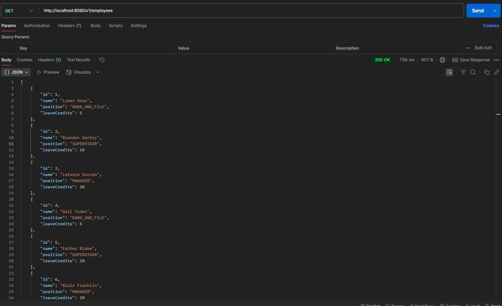

# Employee Leave Allocation API (Programming Task)
A backend REST API that will handle employee leave allocation with below requirements:

- The program should simulate a leave allocation system for a total of 10 employees.
- Each employee should have a designation:
  - Rank and File – 5 leave credits
  - Supervisor – 10 leave credits
  - Manager – 20 leave credits
- The program should:
  - Clearly define the employee structure (e.g., name, position, leave credits)
  - Automatically assign the correct number of leave credits based on the position
  - Display the list of employees with their corresponding roles and leave balances

## Getting Started

Please clone this project into your local machine. 

Please follow the steps outlined from section A to section C.

## Libraries/Tools Used
* Java 17
* Maven
* [Spring Boot](https://spring.io/projects/spring-boot) with the following components:
    * Spring Web
    * Spring Data JPA
* Database
    * Embedded database using [H2](https://www.h2database.com/html/main.html)
* [Lombok](https://projectlombok.org/)


### A. Database setup
This application uses H2 database.

1. **H2** database
    1. The `application.properties` under the **src/main/resources** has already been configured to connect using H2. 
       ```
       spring.datasource.url=jdbc:h2:mem:leave_allocation
       spring.datasource.driverClassName=org.h2.Driver
       spring.datasource.username=sa
       spring.datasource.password=

       ```
    2. One can access the H2 console given that the application is already up and running (proceed to **section B**):
        1. Access the H2 console in your browser using below URL
           ```
           http://localhost:8080/h2-console
           ```
        2. Change the JDBC URL input to its corresponding URL in `application.properties`. Below is the default setting:
           ```
           jdbc:h2:mem:leave_allocation
           ```

### B. Run the Spring Boot application
1. Open your IDE (**e.g.,** IntelliJ)
2. Go to [LeaveAllocationApplication](src/main/java/com/bcc/leave_allocation/LeaveAllocationApplication.java)
3. Right-click then select **Run/Debug**.
4. This will run the Spring Boot application - below is the expected logs at startup.

```
 _                         _   _ _              _   _              _             _ _         _   _
 | |   ___ __ ___ _____    /_\ | | |___  __ __ _| |_(_)___ _ _     /_\  _ __ _ __| (_)__ __ _| |_(_)___ _ _
 | |__/ -_) _` \ V / -_)  / _ \| | / _ \/ _/ _` |  _| / _ \ ' \   / _ \| '_ \ '_ \ | / _/ _` |  _| / _ \ ' \
 |____\___\__,_|\_/\___| /_/ \_\_|_\___/\__\__,_|\__|_\___/_||_| /_/ \_\ .__/ .__/_|_\__\__,_|\__|_\___/_||_|
                                                                       |_|  |_|                              
2025-05-15T17:18:16.748+08:00  INFO 7264 --- [           main] c.b.l.LeaveAllocationApplication         : Starting LeaveAllocationApplication using Java 17.0.10 with PID 7264 (C:\devel\workspace_bcc\leave-allocation\target\classes started by iamnehj in C:\devel\workspace_bcc\leave-allocation)
2025-05-15T17:18:16.756+08:00  INFO 7264 --- [           main] c.b.l.LeaveAllocationApplication         : No active profile set, falling back to 1 default profile: "default"
2025-05-15T17:18:18.461+08:00  INFO 7264 --- [           main] .s.d.r.c.RepositoryConfigurationDelegate : Bootstrapping Spring Data JPA repositories in DEFAULT mode.
2025-05-15T17:18:18.629+08:00  INFO 7264 --- [           main] .s.d.r.c.RepositoryConfigurationDelegate : Finished Spring Data repository scanning in 138 ms. Found 1 JPA repository interface.
2025-05-15T17:18:19.966+08:00  INFO 7264 --- [           main] o.s.b.w.embedded.tomcat.TomcatWebServer  : Tomcat initialized with port 8080 (http)
2025-05-15T17:18:20.007+08:00  INFO 7264 --- [           main] o.apache.catalina.core.StandardService   : Starting service [Tomcat]
2025-05-15T17:18:20.007+08:00  INFO 7264 --- [           main] o.apache.catalina.core.StandardEngine    : Starting Servlet engine: [Apache Tomcat/10.1.40]
2025-05-15T17:18:20.163+08:00  INFO 7264 --- [           main] o.a.c.c.C.[Tomcat].[localhost].[/]       : Initializing Spring embedded WebApplicationContext
2025-05-15T17:18:20.167+08:00  INFO 7264 --- [           main] w.s.c.ServletWebServerApplicationContext : Root WebApplicationContext: initialization completed in 3269 ms
2025-05-15T17:18:20.601+08:00  INFO 7264 --- [           main] o.hibernate.jpa.internal.util.LogHelper  : HHH000204: Processing PersistenceUnitInfo [name: default]
2025-05-15T17:18:20.761+08:00  INFO 7264 --- [           main] org.hibernate.Version                    : HHH000412: Hibernate ORM core version 6.6.13.Final
2025-05-15T17:18:20.836+08:00  INFO 7264 --- [           main] o.h.c.internal.RegionFactoryInitiator    : HHH000026: Second-level cache disabled
2025-05-15T17:18:21.440+08:00  INFO 7264 --- [           main] o.s.o.j.p.SpringPersistenceUnitInfo      : No LoadTimeWeaver setup: ignoring JPA class transformer
2025-05-15T17:18:21.494+08:00  INFO 7264 --- [           main] com.zaxxer.hikari.HikariDataSource       : HikariPool-1 - Starting...
2025-05-15T17:18:21.833+08:00  INFO 7264 --- [           main] com.zaxxer.hikari.pool.HikariPool        : HikariPool-1 - Added connection conn0: url=jdbc:h2:mem:leave_allocation user=SA
2025-05-15T17:18:21.837+08:00  INFO 7264 --- [           main] com.zaxxer.hikari.HikariDataSource       : HikariPool-1 - Start completed.
2025-05-15T17:18:21.893+08:00  WARN 7264 --- [           main] org.hibernate.orm.deprecation            : HHH90000025: H2Dialect does not need to be specified explicitly using 'hibernate.dialect' (remove the property setting and it will be selected by default)
2025-05-15T17:18:21.950+08:00  INFO 7264 --- [           main] org.hibernate.orm.connections.pooling    : HHH10001005: Database info:
	Database JDBC URL [Connecting through datasource 'HikariDataSource (HikariPool-1)']
	Database driver: undefined/unknown
	Database version: 2.3.232
	Autocommit mode: undefined/unknown
	Isolation level: undefined/unknown
	Minimum pool size: undefined/unknown
	Maximum pool size: undefined/unknown
2025-05-15T17:18:23.854+08:00  INFO 7264 --- [           main] o.h.e.t.j.p.i.JtaPlatformInitiator       : HHH000489: No JTA platform available (set 'hibernate.transaction.jta.platform' to enable JTA platform integration)
2025-05-15T17:18:24.028+08:00  INFO 7264 --- [           main] j.LocalContainerEntityManagerFactoryBean : Initialized JPA EntityManagerFactory for persistence unit 'default'
2025-05-15T17:18:24.789+08:00  WARN 7264 --- [           main] JpaBaseConfiguration$JpaWebConfiguration : spring.jpa.open-in-view is enabled by default. Therefore, database queries may be performed during view rendering. Explicitly configure spring.jpa.open-in-view to disable this warning
2025-05-15T17:18:25.496+08:00  INFO 7264 --- [           main] o.s.b.a.h2.H2ConsoleAutoConfiguration    : H2 console available at '/h2-console'. Database available at 'jdbc:h2:mem:leave_allocation'
2025-05-15T17:18:25.661+08:00  INFO 7264 --- [           main] o.s.b.w.embedded.tomcat.TomcatWebServer  : Tomcat started on port 8080 (http) with context path '/'
2025-05-15T17:18:25.686+08:00  INFO 7264 --- [           main] c.b.l.LeaveAllocationApplication         : Started LeaveAllocationApplication in 10.044 seconds (process running for 10.853)
```

### C. Test REST API using Postman
#### C.1. Read API
1. Use below URL mapping (use **GET**):

```
http://localhost:8080/v1/employees
```

2. See sample response below:
   


